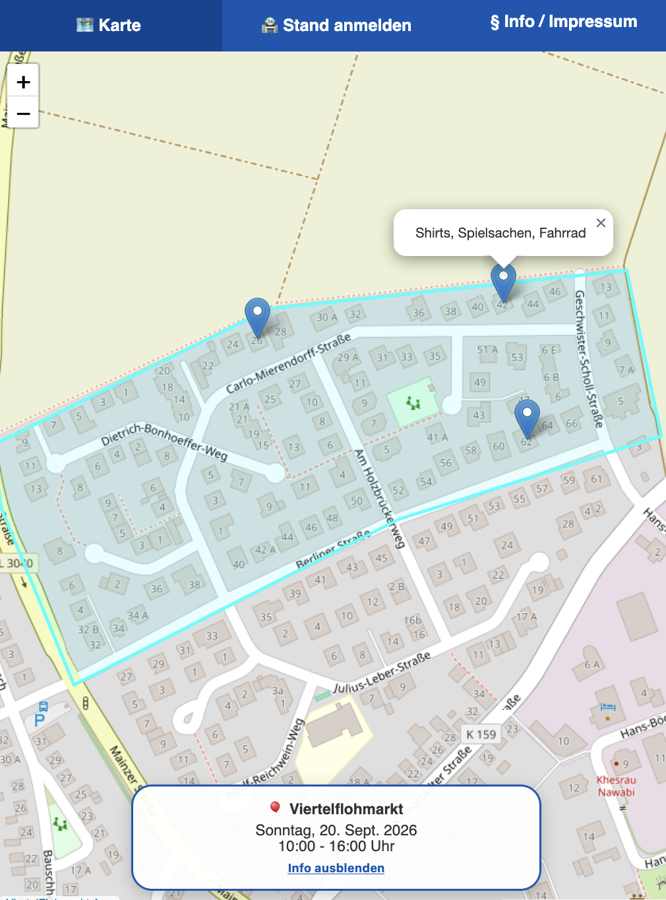
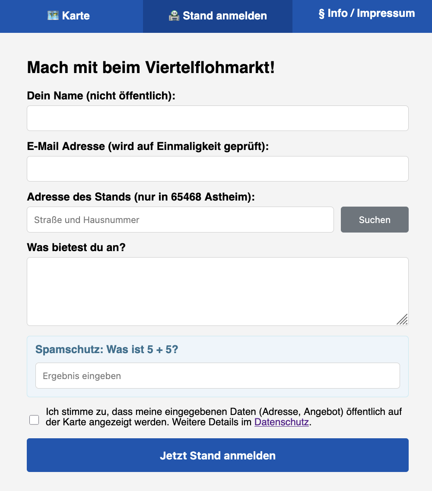
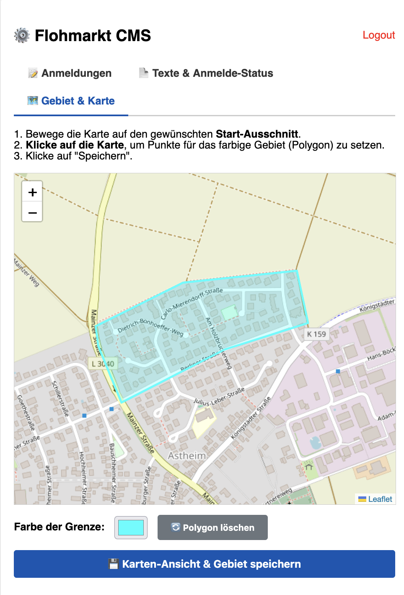
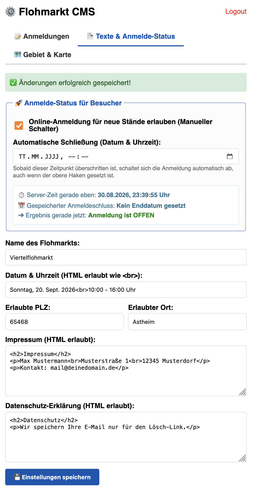

# ViertelFlohmarkt App

Eine webbasierte Open-Source-Plattform für lokale Viertel- und Garagenflohmärkte. Die Anwendung ermöglicht es Nachbarn, ihre Stände unkompliziert über eine interaktive Karte anzumelden, und bietet Administrator:innen ein übersichtliches CMS zur Verwaltung.

## 📱 App-Vorschau

</img> </img> </img> </img> 

---

## 🚀 Funktionen

* **Interaktive Karte:** Zeigt alle freigeschalteten Flohmarktstände auf einer OpenStreetMap-Karte inklusive Beschreibung und Adresse an.
* **Stand-Anmeldung:** Komfortable Online-Anmeldung für Teilnehmer mit automatischer Adressvalidierung (Nominatim/OpenStreetMap).
* **Automatischer Anmeldeschluss:** Zeitgesteuerte oder manuelle Deaktivierung der Anmeldung.
* **Admin-Bereich (CMS):** Freigabe, Deaktivierung und Löschung von Ständen, Anpassung von Texten (Impressum, Datenschutz) sowie Definition des erlaubten PLZ-Gebiets und eines farbigen Begrenzungs-Polygons.
* **Erweiterte Sicherheit & Datenschutz:**
  * **Honeypot-Spamschutz:** Effektive Bot-Abwehr bei der Stand-Anmeldung ohne nervige Captchas.
  * **CSRF- & Rate-Limiting-Schutz:** Schutz vor automatisierten Angriffsversuchen und IP-Sperre bei mehrfachen Falscheingaben im Admin-Login.
  * **Geführter Ersteinrichtungs-Zwang:** Erfordert beim ersten Einloggen zwingend die Vergabe eines neuen Admin-Passworts.
  * **Datenschutz:** DSGVO-konforme Formularabfragen und token-basierte Stand-Löschung durch die Teilnehmer selbst.

---

## 📦 Anleitung zum einfachen Selbst-Hosting

Die Anwendung benötigt einen einfachen Webserver mit **PHP** und einer **MySQL- / MariaDB-Datenbank**.

### Voraussetzungen

* Webhosting-Paket oder ein eigener Server (z. B. VPS, Raspberry Pi, XAMPP für lokal)
* PHP ab Version 8.0 inkl. `PDO` und `DOMDocument` Extension
* MySQL oder MariaDB Datenbank

### Schritt-für-Schritt-Installation

1. **Dateien hochladen:**
   Lade alle Projektdateien (`index.php`, `admin.php`, `config.php`, etc.) in das Root-Verzeichnis deines Webservers hoch.

2. **Konfiguration anpassen (`config.php`):**
   Öffne die Datei `config.php` und trage deine Domain sowie deine Datenbank-Zugangsdaten ein:
   ```php
   $app_domain = 'www.dein-flohmarkt.de'; // Deine Domain (ohne https://)

   $db_host = 'localhost';$db_name = 'dein_datenbank_name';
   $db_user = 'dein_datenbank_benutzer';$db_pass = 'dein_datenbank_passwort';

3. **Tabellen automatisch erstellen lassen:**
Beim ersten Aufruf der Website oder des Admin-Bereichs werden alle benötigten Datenbanktabellen automatisch angelegt.
Erster Login & Admin-Passwort vergeben:

 * Rufe admin.php in deinem Browser auf.
 * Logge dich mit dem initialen Standard-Passwort admin123 ein.
* Das System fordert dich direkt beim ersten Login auf, dein eigenes, sicheres Admin-Passwort festzulegen.

4.  **Flohmarkt konfigurieren:**
    Passe im Admin-Bereich unter Texte & Anmelde-Status sowie Gebiet & Karte die Einstellungen an deinen eigenen Viertel-Flohmarkt an!

### 📄 Lizenz

Dieses Projekt steht unter der MIT-Lizenz.

Du darfst den Code frei verwenden, kopieren, verändern, zusammenführen, veröffentlichen, verbreiten und sowohl für private als auch kommerzielle Zwecke einsetzen – unter der Bedingung, dass der bestehende Urheberrechtsvermerk erhalten bleibt.
